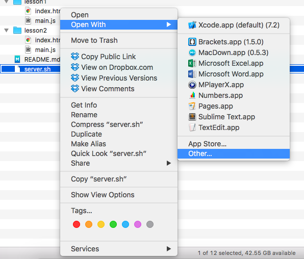
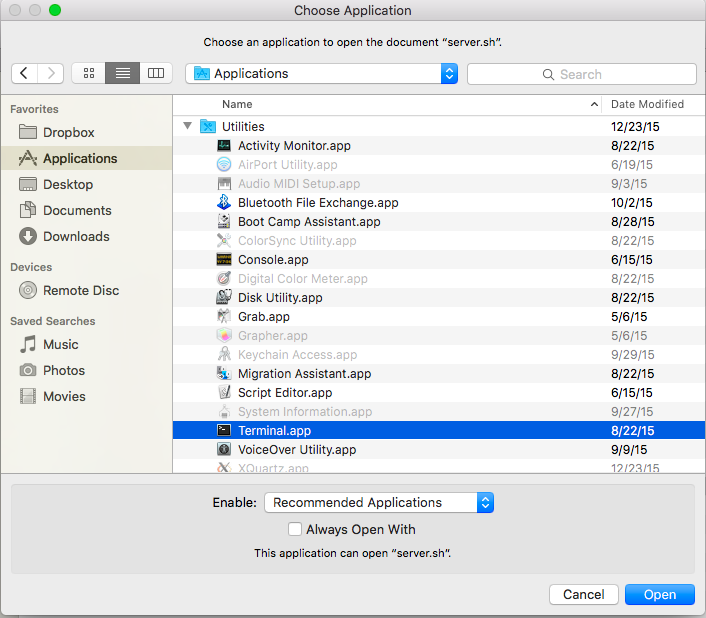
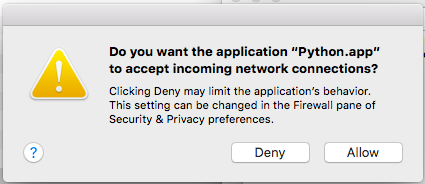

# Overview
This is a series of React tutorials meant for those who are new to web development. Each folder is a lesson that builds on the previous one.

Each folder contains ``index.html`` and ``main.js``. ``index.html`` should be left alone - ``main.js`` contains the tutorial body.
# Running
## Mac
1. Right click on ``server.sh`` and clicking ``open with`` -> ``Other...``  
2. Navigate to to ``Utilities`` -> ``Terminal`` and click ``open`` 
3. Type ``server.sh`` and hit enter. Hit ``Deny`` when asked if you want to accept incoming network connections.  
4. Navigate to the lesson outputs with the following links
  * [lesson 0: Basic explanation](http://localhost:8000/lesson0/)
  * [lesson 1: Interaction](http://localhost:8000/lesson1/)
  * [lesson 2: Composition](http://localhost:8000/lesson2/)
  * [lesson 3: Styles](http://localhost:8000/lesson3/)

Leave the Terminal window open as long as you want to use this tutorial. Make sure to run steps 1-3 whenever you want to revisit the tutorial.

## Windows
No Windows tutorial yet!